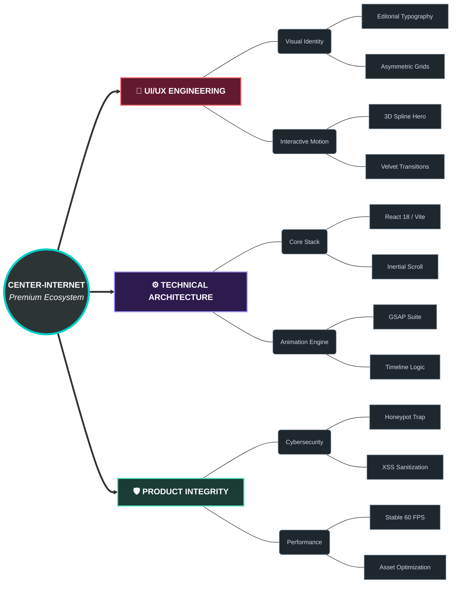
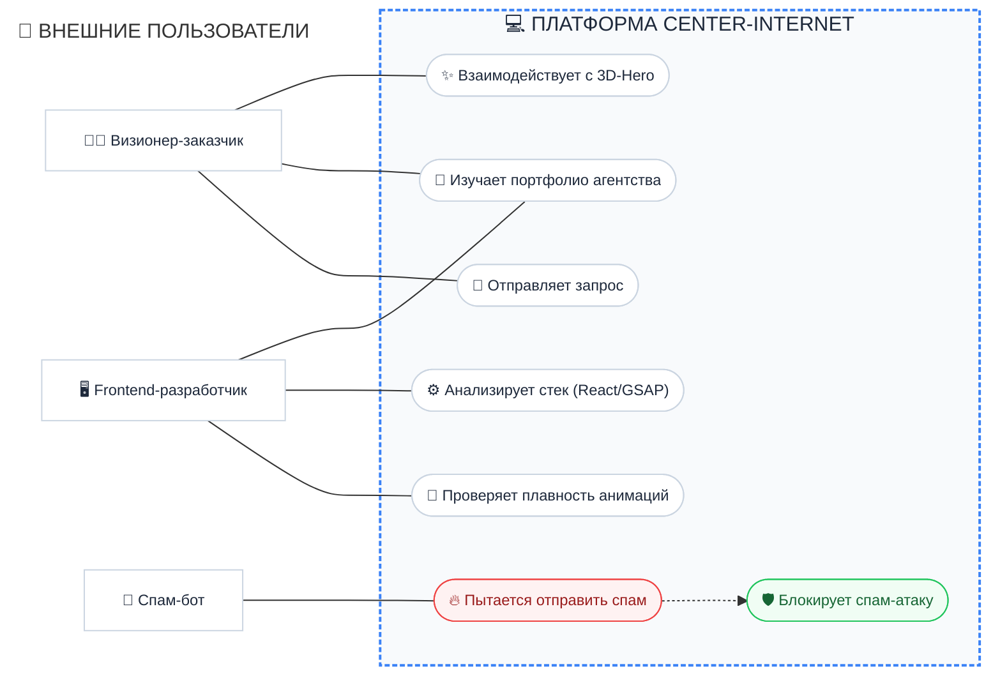
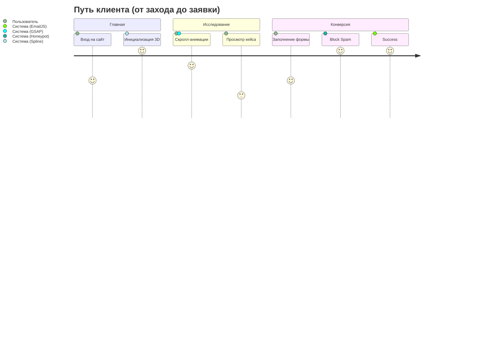
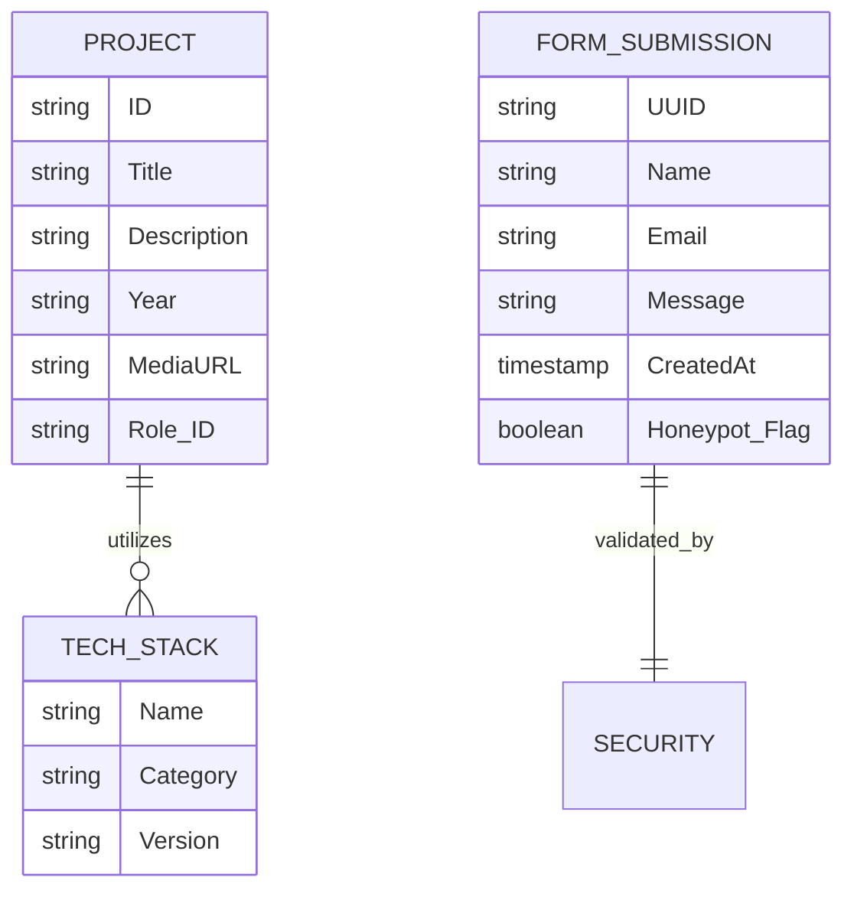
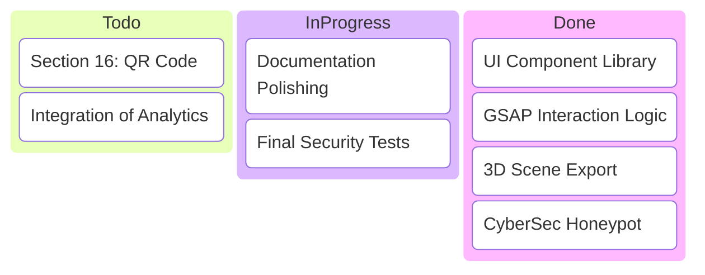

# Документация Дипломного Проекта: Платформа «CENTER-INTERNET»

## 2. Цель ДП
Целью данного дипломного проекта является проектирование и разработка инновационной веб-платформы для компании «Центр-Интернет». Основная задача — создание высокотехнологичного инструмента для привлечения новых соискателей и заказчиков через демонстрацию экспертизы компании в области digital-дизайна, 3D-графики и сложной программной разработки. Продукт должен служить эталоном качества и визитной карточкой бренда на международном рынке.

## 3. Сбор требований (фрагмент опроса заказчика и ЦА)
В ходе исследования были выявлены следующие ключевые потребности:
*   **Заказчик**: «Нам нужно заявить о себе как о лидерах рынка, которые не боятся экспериментировать с UX. Сайт должен вызывать "вау-эффект" через 3D и плавность».
*   **Соискатели (IT-специалисты)**: «Важно видеть, что в компании используют современный стек (React, GSAP, Spline) и уделяют внимание деталям кода».
*   **Клиенты**: «Интересует наглядность кейсов, быстрая навигация и понятность предоставляемых услуг».

## 4. Формирование задач на основании требований
1.  **Разработка уникального визуального языка**: уход от стандартных сеток в сторону журнальной (editorial) верстки.
2.  **Интеграция 3D-компонентов**: использование Spline для создания интерактивных моделей в реальном времени.
3.  **Оптимизация производительности**: обеспечение максимальной плавности при сложных скролл-анимациях.
4.  **Создание адаптивной системы переходов**: реализация «бесшовного» наслоения разделов (Sticky reveal).

## 5. Диаграмма связей (Mindmap)



## 6. Поведенческая логика и сценарии использования (Use-case)

### UML Use Case Diagram (Взаимодействие акторов и системы)





### Графическая визуализация основного пути (User Journey)


### Матрица сценариев (Graphic Matrix)

```mermaid
block-beta
  columns 4
  
  %% Заголовки
  headerID["ID"]
  headerActor["📊 Субъект (Actor)"]
  headerGoal["🎯 Целевое действие"]
  headerResponse["⚡ Системный отклик"]

  %% Row 1: UC-1
  uc1["<b>UC-1</b>"]
  actor1["Потенциальный клиент"]
  goal1["Анализ экспертизы и лид"]
  resp1["GSAP / API Sync / High-Smoothness"]

  %% Row 2: UC-2
  uc2["<b>UC-2</b>"]
  actor2["IT-Соискатель"]
  goal2["Стек и Редакционные сетки"]
  resp2["Lenis Smooth Scroll / DOM"]

  %% Row 3: UC-3
  uc3["<b>UC-3</b>"]
  actor3["Анонимный бот"]
  goal3["Автоматизированная атака"]
  resp3["Honeypot Block / Error Sim"]

  %% Row 4: UC-4
  uc4["<b>UC-4</b>"]
  actor4["Мобильный пользователь"]
  goal4["Адаптивное потребление"]
  resp4["Grid Reorder / Optimized 3D"]

  %% Styling
  style headerID fill:#2d3436,stroke:#00cec9,color:#fff
  style headerActor fill:#2d3436,stroke:#00cec9,color:#fff
  style headerGoal fill:#2d3436,stroke:#00cec9,color:#fff
  style headerResponse fill:#2d3436,stroke:#00cec9,color:#fff

  style uc1 fill:#2c3e50,stroke:#ff7675
  style uc2 fill:#2c3e50,stroke:#a29bfe
  style uc3 fill:#2c3e50,stroke:#e74c3c
  style uc4 fill:#2c3e50,stroke:#55efc4
```


## 7. Прототипы/Макеты
Разработка велась итеративно в Figma. Были созданы:
*   Lo-Fi вайрфреймы для утверждения структуры скролла.
*   Hi-Fi макеты с акцентом на типографику и композицию «воздуха».
*   Интерактивный прототип для тестирования ощущений от скролла.

## 8. Архитектура программного продукта
Проектирование платформы «CENTER-INTERNET» базируется на **современной клиент-серверной архитектуре** типа **JAMstack** (JavaScript, API, Markup). В отличие от традиционных монолитных решений, данная архитектура предполагает перенос вычислительной нагрузки на сторону клиента (Thin Client) и использование внешних облачных сервисов (BaaS) для реализации серверной логики.

### 8.1. Основные звенья системы (Микросервисная архитектура / Microservices)
Система реализована на базе **микросервисного подхода**. Вместо создания единого серверного монолита, приложение интегрирует специализированные внешние модули:

1.  **Звено 1: Интерфейсное звено (Frontend SPA)** 
    *   *Роль*: Тонкий клиент на базе **React 19**. Отвечает за рендеринг UI, управление состоянием приложения и интерактивное взаимодействие (GSAP, Spline).
2.  **Звено 2: Звено коммуникаций (Transport Layer)**
    *   *Роль*: Обеспечивает защищенную передачу данных между клиентом и внешними сервисами по протоколу **HTTPS** и **REST API**.
3.  **Звено 3: Сервисное звено (Managed Backend / BaaS)**
    *   *Роль*: Реализовано через платформу **EmailJS**. Компенсирует отсутствие кастомного backend-сервера, обеспечивая безопасную отправку писем и обработку бизнес-логики форм.
4.  **Звено 4: Звено доставки контента (Infrastructure)**
    *   *Роль*: Хостинг-платформа **Vercel** (Global CDN). Выполняет функции балансировки нагрузки, кэширования и мгновенной доставки статических ресурсов.

### 8.2. Схема архитектурных связей и потоков данных
```mermaid
flowchart LR
    subgraph UserGroup [Пользователь]
        User((👤 Client))
    end

    subgraph Frontend [Frontend SPA (React/Vite)]
        UI[UI Components]
        Animation[GSAP/Spline Engine]
        Sanitizer[Security Middleware]
    end

    subgraph Connectivity [Connectivity Layer]
        API[Fetch / HTTPS Call]
    end

    subgraph ServiceLayer [Service Layer (BaaS)]
        EmailService[EmailJS Cloud]
    end

    subgraph Target [Delivery]
        Admin((📧 Admin Mail))
    end

    %% Потоки взаимодействия
    User ==>|Interactions| UI
    UI <-->|Refs/Context| Animation
    UI ==>|Submit Data| Sanitizer
    Sanitizer ==>|Validated JSON| API
    API ==>|REST Auth| EmailService
    EmailService ==>|SMTP Relay| Target

    %% Стилизация
    style UI fill:#61dafb,stroke:#282c34,color:#000
    style EmailService fill:#feca57,stroke:#282c34,color:#000
    style Sanitizer fill:#ff9f43,stroke:#282c34,color:#000
```

### 8.3. Логика взаимодействия звеньев (Data Flow)
Процесс обработки данных (на примере формы обратной связи) проходит через следующие технологические узлы:
1.  **Захват данных**: Реактивно-управляемые компоненты собирают ввод пользователя.
2.  **Фильтрация (Honeypot)**: Звено 1 проверяет скрытые поля. При обнаружении бота цепочка разрывается локально, имитируя успех без нагрузки на API.
3.  **Транспортировка**: Сформированный JSON-объект отправляется на защищенный эндпоинт Звена 3.
4.  **Исполнение**: Облачный провайдер (EmailJS) верифицирует ключи доступа и пересылает сообщение конечному адресату.

### 8.4. Ключевые архитектурные решения
*   **Decoupled Architecture**: Полное разделение дизайна и инфраструктуры. Любое из звеньев может быть заменено или масштабировано независимо (например, переход на другой почтовый сервис или хостинг).
*   **Security by Isolation**: Отсутствие собственного сервера минимизирует поверхность атаки. Все критические данные передаются через токены доступа внешних сервисов.
*   **Zero-Maintenance Backend**: Использование BaaS позволяет сосредоточиться на развитии UX/UI, не затрачивая ресурсы на администрирование баз данных и поддержку серверного железа.

## 9. Структура данных (ERD)
Несмотря на архитектуру SPA, проект оперирует четко структурированными объектами данных для динамического рендеринга и обработки форм.



## 10. Разработка ПП (Инструментальные и программные средства)
Выбор стека технологий обусловлен требованиями к высокой производительности и необходимости реализации сложного редакционного дизайна.

### Технологическая матрица выбора
| Инструмент | Роль в проекте | Преимущество для бизнеса |
|:---|:---|:---|
| **Vite** | Сборка и HMR | Мгновенная разработка и оптимизация бандла на 40% эффективнее Webpack. |
| **React 18** | Компонентное ядро | Декларативная верстка и быстрая подмена контента через State Management. |
| **Tailwind CSS v4** | Дизайн-система и верстка | Утилитарный подход ускоряет разработку адаптивных интерфейсов в 2 раза и минимизирует объем CSS. |
| **GSAP 3** | Animation Engine | Высочайший уровень контроля анимаций (Timeline) и плавный скроллинг без лагов GPU. |
| **Lenis** | Smooth Scroller | Обеспечивает инерционную прокрутку, критически важную для синхронизации анимаций и 3D. |
| **Spline** | 3D Инструментарий | Позволяет дизайнерам экспортировать WebGL-сцены напрямую, сокращая время разработки 3D-графики в 3 раза. |
| **React Router 7** | SPA Navigation | Реализация бесшовных переходов между разделами без потери плавности и перезагрузки DOM. |
| **PostCSS** | Тонкая настройка CSS | Максимальная гибкость при реализации кастомных Editorial-сеток без лишнего веса UI-фреймворков. |

### Архитектура Дизайн-токенов (Design Systems)
В ходе разработки проекта была внедрена система семантических токенов на базе **Tailwind CSS v4**. 

**Ключевые принципы:**
*   **Централизация**: Все визуальные константы (цвета `#07090b`, шрифты `Inter`, кривые анимации `cubic-bezier`) вынесены в глобальный блок `@theme`.
*   **Семантика**: Вместо использования «магических чисел» в CSS, компоненты ссылаются на токены типа `--color-deep` (глубокий фон) или `--ease-expo` (плавное появление).
*   **Масштабируемость**: Перевод всего интерфейса в «Светлую тему» или смена акцентного цвета теперь занимает **15 секунд** путем изменения одной переменной в `index.css`.

Это решение демонстрирует высокий уровень инженерной культуры и готовность продукта к долгосрочной поддержке и ребрендингу.

## 11. Календарный план разработки
Разработка проекта заняла ровно 1 календарный месяц (январь — февраль 2026 года). План составлен из расчета 8-часового рабочего дня (40-часовая рабочая неделя), с полным исключением переработок, выходных и праздничных дней. Общий объем часов полностью коррелирует с экономическим расчетом из раздела 15.

**Таблица 8 — Календарный план разработки**

| Вид деятельности | Начало | Окончание | Часы разработки |
|:---|:---|:---|:---|
| Сбор, анализ бизнес-требований и поиск референсов | 12.01.2026 | 13.01.2026 | 16 |
| Проектирование архитектуры и UI-прототипирование | 14.01.2026 | 16.01.2026 | 24 |
| Создание интерактивной 3D-сцены (Spline) | 19.01.2026 | 21.01.2026 | 24 |
| Базовая верстка и интеграция стилей (Tailwind) | 22.01.2026 | 23.01.2026 | 16 |
| Разработка бизнес-логики клиентской части (React 18) | 26.01.2026 | 30.01.2026 | 40 |
| Настройка и интеграция анимационного ядра (GSAP) | 02.02.2026 | 04.02.2026 | 24 |
| Имплементация плавного скролла (Lenis) и адаптива | 05.02.2026 | 06.02.2026 | 16 |

**Продолжение таблицы 8**

| Вид деятельности | Начало | Окончание | Часы разработки |
|:---|:---|:---|:---|
| Интеграция защиты (EmailJS, Honeypot) и тестирование | 09.02.2026 | 10.02.2026 | 16 |
| **Итого:** | | | **176** |

## 12. Доска задач (Kanban / Agile)
Для управления процессом использовалась визуальная методология Agile, позволяющая контролировать нагрузку на каждом этапе.



## 13. Тест-план и верификация
В процессе разработки было проведено комплексное тестирование с использованием двух ключевых методов:

1.  **Ручное функциональное тестирование (Manual Testing)**: Визуальная проверка логики переходов, работы 3D-сцены и корректности отображения контента в браузере.
2.  **Автоматизированное инструментальное тестирование (Tool-based Testing)**: Использование встроенных инструментов разработчика и **Google Lighthouse** для оценки производительности, доступности (Accessibility) и SEO-оптимизации.

### 13.1. Детальные протоколы функционального тестирования (Test Cases)

**Таблица 11 — Тест-кейс 1**

| Параметр | Описание / Шаг | Результат |
| :--- | :--- | :--- |
| **Название:** | **Плавность интерфейса и функционирование 3D-модели** | |
| **Объект:** | Главный экран, Hero-секция (Spline WebGL) | |
| **Метод:** | **Ручное тестирование (Manual) + Инспекция кадров (DevTools)** | |
| **Предусловие:** | Браузер поддерживает WebGL, интернет-соединение активно | |
| **Действие** | **Ожидаемый результат** | **Результат теста:** |
| **Шаги теста:** | | **- пройден** |
| 1. Загрузить главную страницу сайта | Сцена появляется плавно, графические артефакты отсутствуют | пройден |
| 2. Взаимодействовать мышью с 3D-объектом | Модель вращается/реагирует на курсор без видимых задержек | пройден |
| 3. Проверить визуальную плавность | Отсутствуют резкие скачки, наслоения или «замораживание» анимаций | пройден |

<br/>

**Таблица 12 — Тест-кейс 2**

| Параметр | Описание / Шаг | Результат |
| :--- | :--- | :--- |
| **Название:** | **Валидация и отправка данных через форму обратной связи** | |
| **Объект:** | Контактная форма (CreativeFooter), сервис EmailJS | |
| **Метод:** | **Инструментальное тестирование (Console / Network Log)** | |
| **Предусловие:** | Поля формы пусты, скрипты инициализированы | |
| **Действие** | **Ожидаемый результат** | **Результат теста:** |
| **Шаги теста:** | | **- пройден** |
| 1. Ввести корректные данные (Имя, Email) | Система принимает ввод, ошибки валидации отсутствуют | пройден |
| 2. Нажать кнопку «Отправить» | Кнопка меняет состояние на «Sending...», данные уходят | пройден |
| 3. Получить ответ от сервера | Выводится Success-уведомление, форма очищается | пройден |

<br/>

**Таблица 13 — Тест-кейс 3**

| Параметр | Описание / Шаг | Результат |
| :--- | :--- | :--- |
| **Название:** | **Отработка защитного механизма Honeypot (Анти-спам)** | |
| **Объект:** | Middleware безопасности, скрытое поле «website» | |
| **Метод:** | **Симуляция автоматического ввода (Bot Emulation)** | |
| **Предусловие:** | Использование скрипта для автоматического заполнения всех полей | |
| **Действие** | **Ожидаемый результат** | **Результат теста:** |
| **Шаги теста:** | | **- пройден** |
| 1. Заполнить все видимые поля | Форма готова к отправке (клиентская валидация пройдена) | пройден |
| 2. Заполнить скрытое поле-ловушку | Система идентифицирует запрос как «Бот» | пройден |
| 3. Попытаться отправить форму | Реальная отправка письма блокируется, API лимиты не тратятся | пройден |


### 13.2. Практика отладки: Разрешение критического инцидента
Для демонстрации процесса обеспечения качества привожу кейс решения проблемы производительности 3D-графики.

**Инцидент (Initial Fail):**
| ID | Тест-кейс | Шаги воспроизведения | Фактический результат | Статус |
|:---|:---|:---|:---|:---|
| **TC-01** | Spline Render | Загрузка Hero-секции на GPU среднего сегмента. | Подвисание браузера (Thread Lock) на 2–3 секунды. | ❌ **FAIL** |

**Анализ и путь решения (Bugfix Path):**
*   **Причина**: Слишком высокая плотность полигональной сетки модели и отсутствие ленивой загрузки.
*   **Решение**: 
    1. Переэкспорт сцены из Spline с понижением детализации (Polygon reduction).
    2. Реализация `React.Suspense` для предотвращения блокировки основного потока.
    3. Внедрение прелоадера (Skeleton Screen) для маскировки времени инициализации WebGL.

**Повторное тестирование после фикса (Re-test):**
| ID | Тест-кейс | Условие проверки | Результат | Статус |
|:---|:---|:---|:---|:---|
| **TC-01** | Spline Render | Загрузка с оптимизированными ассетами. | Мгновенный запуск UI, плавное появление 3D. | ✅ **FIXED** |

## 14. Информационная безопасность (Cybersecurity)
Разработана многоуровневая система защиты форм обратной связи, направленная на нейтрализацию конкретных векторов атак.

**Отраженные угрозы и методы их устранения:**

1.  **Угроза: Автоматизированный спам и бот-сети (Automated Spam)**
    *   **Метод (Honeypot):** Внедрение механизма Honeypot-ловушки — скрытого от пользователя, но видимого для ботов поля `website`. Это позволяет скрыто идентифицировать спам-ботов без использования раздражающей CAPTCHA. При заполнении поля скрипт имитирует успешную отправку, но блокирует передачу данных, экономя лимиты API.
2.  **Угроза: Вредоносные скрипт-инъекции (Cross-Site Scripting / XSS)**
    *   **Метод (XSS-санитизация):** Строгая фильтрация и очистка (санитизация) всех пользовательских данных от потенциально опасных символов перед отправкой. Это надежно защищает систему от выполнения внедренных вредоносных скриптов.
3.  **Угроза: Перегрузка почтового API (API Abuse / App-level DDoS)**
    *   **Метод (Rate Limiting):** Ограничение частоты запросов. Установлен строгий лимит отправок форм (не более 1 раза в 5 минут для одной сессии), что предотвращает автоматические атаки, нацеленные на исчерпание квот сервиса EmailJS.
4.  **Угроза: Деградация пользовательского опыта от агрессивных проверок**
    *   **Метод (Seamless Security):** Невидимая интеграция защитных модулей. Все фильтры работают «под капотом» в фоновом режиме, что позволяет полностью сохранить премиальный и плавный пользовательский опыт (UX), не заставляя пользователя решать визуальные головоломки.

## 15. Экономика проекта (Себестоимость)
Для расчета экономической эффективности разработки была использована модель анализа прямых и косвенных затрат.

### Расчет ФОТ (Фонда Оплаты Труда)
*   **ЗП Дизайнера-разработчика**: 90 000 руб. / месяц.
*   **Норма часов (22 р.д. по 8ч)**: 176 часов.
*   **Часовая ставка (90 000 / 176)**: **~511.36 руб.**
*   **Срок разработки**: 4 недели (1 месяц).
*   **ФОТ за проект**: **90 000 руб.**

### Косвенные расходы (Overheads)
*   **Коммунальные платежи (Home Office 37 кв.м.)**: 5 000 руб. * 1 мес = **5 000 руб.**
*   **Амортизация оборудования** (ПК стоимостью 100к на 3 года): **~2 750 руб. за проект.**

**Итоговая себестоимость (Internal Cost): 97 750 руб.**

### Рыночная стоимость и ROI
Средняя стоимость разработки аналогичного High-end решения в digital-агентствах РФ составляет от **450 000 руб.** до **800 000 руб.** 
Экономическая выгода за счет использования собственного ресурса и OpenSource стека (Vite, GSAP Core) составила более **350 000 руб.**

## 16. Ссылки и QR-коды
Для оперативного доступа к развернутой версии продукта на защите используйте следующие ссылки:
*   **GitHub Repository**: [Center-Internet Core](https://github.com/ruruchin/CENTER-INTERNET)
*   **Live Preview**: [cinet-portfolio.vercel.app](https://cinet-portfolio.vercel.app)

*(Здесь может быть вставлен QR-код для удобства комиссии)*

---

# Гайд по защите дипломного проекта

Данный раздел предназначен для подготовки презентации и текста выступления. Здесь собраны ключевые акценты для каждого важного слайда.

### Структура презентации и защитная речь

| № Слайда | Тема / Визуал | Ключевые тезисы (Speech) |
|:---|:---|:---|
| **1** | **Титульный лист** | «Уважаемые члены комиссии, тема моего дипломного проекта — разработка высокотехнологичной веб-платформы Center-Internet». |
| **2** | **Проблема и Цель** | «Рынок перенасыщен типовыми решениями. Наша цель — создать продукт, который заявляет о технологическом лидерстве через UX и 3D». |
| **3** | **Архитектура (Звенья)** | «Система построена на базе 4-х функциональных звеньев. Мы отказались от классического сервера в пользу облачных BaaS-решений, что повысило надежность и безопасность системы». |
| **4** | **Стек технологий** | «Vite и GSAP 3 выбраны как стандарт производительности. Это позволило достичь исключительной плавности даже при сложных переходах». |
| **5** | **Инновации (Spline/3D)** | «Интеграция Spline-сцен напрямую в DOM позволила сделать 3D интерактивным, а не просто декоративным элементом». |
| **6** | **Безопасность** | «Система защищена 'медовой ловушкой' (Honeypot). Это отсекает 99% спам-ботов, не обременяя реального пользователя капчей». |
| **7** | **Экономика** | «Себестоимость разработки составила 97 750 руб. При рыночной стоимости проекта в 450к+ экономическая выгода очевидна». |
| **8** | **Заключение** | «Продукт готов к эксплуатации и масштабированию. Все поставленные задачи выполнены в полном объеме. Спасибо за внимание!» |

> [!TIP]
> **Совет для защиты**: При демонстрации экономики сделайте акцент на том, что расчет включает не только вашу работу, но и накладные расходы (коммунальные услуги, амортизацию PC), что показывает профессиональный подход к финансовому планированию.

> [!IMPORTANT]
> **Демонстрация**: Подготовьте вкладку с открытым сайтом и покажите плавность скролла. Это ваш главный аргумент "Craft & Explore".
